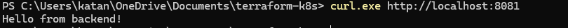
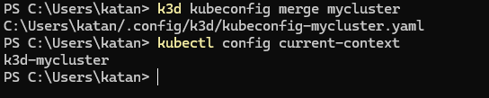
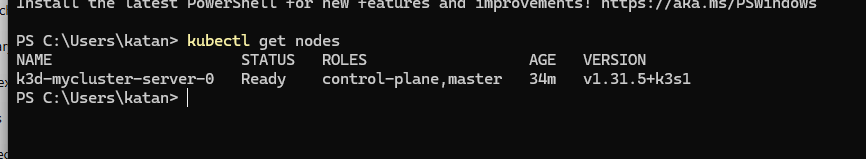
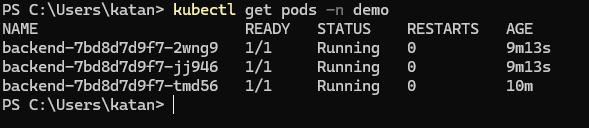

TerraFormProject
CS 454 – Infrastructure as Code Project

This project contains two parts:
1. Terraform + Docker local infrastructure
2. Terraform + Kubernetes (k3d) deployment

==========================================
PART 1 — Terraform Docker Project
=========================================
Goal

Provision a small 3-service local cloud using Docker, fully automated with Terraform.

Services Deployed

Frontend: Nginx (exposed on port 8080)

Backend: Python microservice that returns “Hello from backend!” (exposed on 8081)

Database: Postgres

Networking: All containers connected through a custom Terraform-managed Docker network

How to Run
cd terraform-docker
terraform init
terraform apply -auto-approve

Testing the Deployment
curl.exe http://localhost:8080
curl.exe http://localhost:8081

Expected Output:

Hello from backend!

Enhancement Implemented

✔ Custom Nginx reverse-proxy configuration mounted into the frontend container

==========================================
PART 2 — Terraform Kubernetes Project (k3d)
=========================================
Goal

Deploy the same backend microservice into a Kubernetes cluster created using k3d and provisioned with Terraform.

Kubernetes Resources Created

Namespace (demo)

Deployment (backend with 3 replicas)

Service (LoadBalancer mapping backend port 5000 → node port)

How to Run
cd terraform-k8s
terraform init
terraform apply -auto-approve

Verify the Cluster
kubectl config current-context
kubectl get nodes
kubectl get ns
kubectl get deployment -n demo
kubectl get pods -n demo
kubectl get svc -n demo

Test Kubernetes Deployment
curl.exe http://localhost:8080
curl.exe http://localhost:8081

Expected Output:

Hello from backend!

Enhancement Implemented

✔ Horizontal scaling: Deployment replicas increased to 3

=============================================
Screenshots
============================================================

All screenshots are located in: 📁 **/Screenshots**

---

### Docker Output

  

---

### Kubernetes Setup

  
  

---

### Kubernetes Resources

  
  
  

---

=======================================
Reflection
=========================================

This project gave me hands-on experience with the full lifecycle of Infrastructure as Code using Terraform. For Part 1, I learned how Terraform interacts with Docker, how modules keep infrastructure organized, and how networks, containers, and images are provisioned declaratively. For Part 2, I built and configured a Kubernetes cluster using k3d, deployed workloads with the Kubernetes provider, and verified that my services worked through LoadBalancer networking. The biggest lesson was understanding how Terraform state tracks real-world infrastructure, and how debugging image pulls and provider issues mirrors real DevOps challenges. By the end, I felt confident deploying both Docker- and Kubernetes-based systems completely through Terraform.
